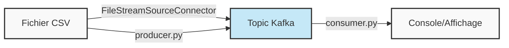
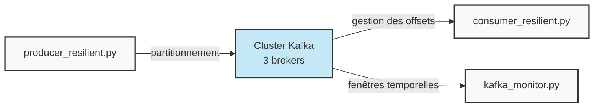

# 🚀 Streaming Data Pipeline

[](https://kafka.apache.org/)
[](https://www.mongodb.com/)
[](https://www.postgresql.org/)
[](https://www.docker.com/)
[](https://www.python.org/)

Un pipeline de données en streaming complet utilisant Apache Kafka, MongoDB, PostgreSQL et Tableau.

## 📌 Description

Ce projet implémente une architecture robuste pour l'ingestion, le traitement et la visualisation de données en temps réel. Il combine plusieurs technologies pour créer un pipeline de données complet, résilient et scalable.


## 🛠️ Technologies

<div align="center">
<table>
  <tr>
    <td align="center" width="96">
      
      <br>Apache Kafka
    </td>
    <td align="center" width="96">
      
      <br>Kafka Connect
    </td>
    <td align="center" width="96">
      
      <br>Apache Flink
    </td>
    <td align="center" width="96">
      
      <br>MongoDB
    </td>
  </tr>
  <tr>
    <td align="center" width="96">
      
      <br>PostgreSQL
    </td>
    <td align="center" width="96">
      
      <br>Python
    </td>
    <td align="center" width="96">
      
      <br>Docker
    </td>
    <td align="center" width="96">
      
      <br>Tableau
    </td>
  </tr>
</table>
</div>
## 🔧 Installation

```bash
# Cloner le repository
git clone https://github.com/your-username/streaming-data-pipeline.git
cd streaming-data-pipeline

# Démarrer les services avec Docker Compose
docker-compose up -d
```

## 🚀 Utilisation

### Exercice 1: Ingestion CSV vers Kafka

```bash
# Démarrer le producteur Kafka
python producer.py

# Démarrer le consommateur Kafka
python consumer.py
```

### Exercice 2: Traitement par fenêtres

```bash
# Démarrer le producteur résilient
python producer_resilient.py

# Démarrer le consommateur résilient
python consumer_resilient.py

# Démarrer le traitement par fenêtres
python kafka_monitor.py
```

### Exercice 3: Pipeline complet

```bash
# Étape 1: Génération de données
python producer.py

# Étape 2: MongoDB Consumer
python consumer.py

# Étape 3: Export CSV planifié
python schedule_export.py

# Étape 4: Migration vers PostgreSQL
python pg.py
```

## 📊 Visualisation

- Connectez Tableau à la base de données PostgreSQL
- Importez les tableaux de bord fournis
- Explorez les données avec des filtres interactifs par période, région et produit

## 🏗️ Structure du projet

<details>
<summary>📂 Cliquez pour voir l'arborescence du projet</summary>

```
streaming-data-pipeline/
├── 📄 docker-compose.yml        # Configuration des conteneurs
├── 📂 exercice1/
│   ├── 📄 connector.json        # Configuration Kafka Connect
│   ├── 🐍 producer.py           # Producteur CSV vers Kafka
│   └── 🐍 consumer.py           # Consommateur Kafka
├── 📂 exercice2/
│   ├── 🐍 producer_resilient.py # Producteur avec résilience
│   ├── 🐍 consumer_resilient.py # Consommateur avec gestion d'offsets
│   └── 🐍 kafka_monitor.py      # Traitement par fenêtres
└── 📂 exercice3/
    ├── 🐍 producer.py           # Génération de données de ventes
    ├── 🐍 consumer.py           # Stockage dans MongoDB
    ├── 🐍 schedule_export.py    # Export CSV régulier
    └── 🐍 pg.py                 # Migration vers PostgreSQL
```
</details>

## ⚙️ Fonctionnalités

<div align="center">

| Fonctionnalité | Description |
| --- | --- |
| 📥 **Ingestion de données en streaming** | Lecture continue de fichiers CSV |
| 🔄 **Résilience** | Stratégies de reprise, réplication et gestion des pannes |
| 📈 **Scalabilité** | Architecture distribuée supportant la montée en charge |
| ⏱️ **Traitement par fenêtres** | Agrégation par fenêtres temporelles |
| 🗄️ **Stockage multi-niveaux** | Pipeline complet de Kafka à PostgreSQL |
| 📊 **Visualisation** | Tableaux de bord dynamiques avec Tableau |

</div>

## 📝 Détails d'implémentation

<details>
<summary><b>🔄 Exercice 1: Ingestion CSV vers Kafka</b></summary>



- ✅ Utilisation de Kafka Connect avec FileStreamSourceConnector
- ✅ Développement d'un producteur Python pour la surveillance continue
- ✅ Transformation des données CSV en JSON
</details>

<details>
<summary><b>🔄 Exercice 2: Kafka Résilient & Traitement par fenêtres</b></summary>



- ✅ Cluster Kafka avec 3 brokers pour la haute disponibilité
- ✅ Configuration acks=all, retries, backoff pour la résilience
- ✅ Traitement par fenêtres glissantes d'une minute

```mermaid
graph LR
    A[producer.py] -->|Génération de données| B[Topic Kafka]
    B -->|consumer.py| C[MongoDB]
    C -->|schedule_export.py| D[Fichier CSV]
    D -->|pg.py| E[PostgreSQL]
    E -->|connexion| F[Tableau]
    style A fill:#f9f9f9,stroke:#333,stroke-width:2px
    style B fill:#c5e8f7,stroke:#333,stroke-width:2px
    style C fill:#c7e9c0,stroke:#333,stroke-width:2px
    style D fill:#f9f9f9,stroke:#333,stroke-width:2px
    style E fill:#dad5eb,stroke:#333,stroke-width:2px
    style F fill:#ffeaa5,stroke:#333,stroke-width:2px
```

</details>

<details>
<summary><b>🔄 Exercice 3: Pipeline MongoDB-PostgreSQL</b></summary>



- ✅ Génération de données de ventes (produit, région, montant, date)
- ✅ Stockage dans MongoDB avec indexation
- ✅ Export CSV programmé toutes les 2 minutes
- ✅ Migration vers PostgreSQL pour l'analyse avancée
- ✅ Visualisation avec Tableau
</details>

